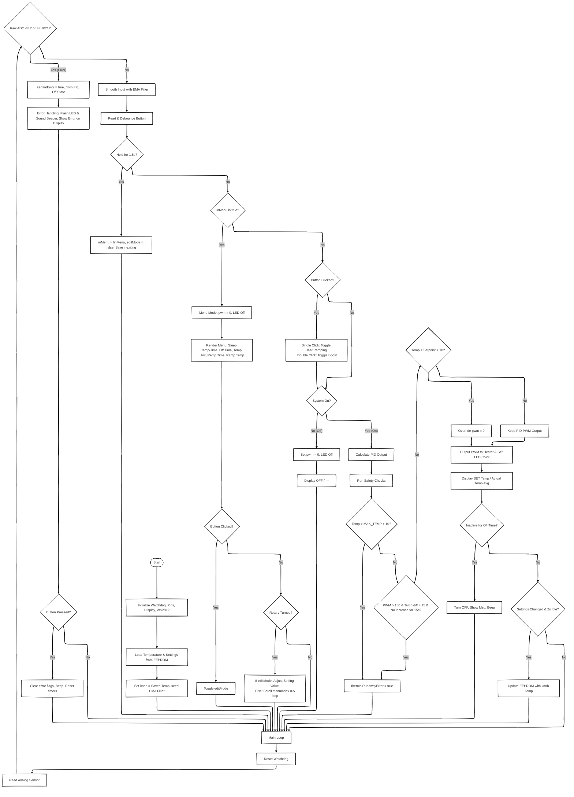

```mermaid

---
config:
  theme: neo
  layout: elk
  look: handDrawn
---
flowchart TD
    Start([Start]) --> Init[Initialize Watchdog, Pins, Display, WS2812]
    Init --> ReadSaved[Load Temperature & Settings from EEPROM]
    ReadSaved --> SetInit[Set knob = Saved Temp, seed EMA Filter]
    SetInit --> Loop[Main Loop]
    Loop --> ResetWDT[Reset Watchdog]
    ResetWDT --> ReadSensor[Read Analog Sensor]
    ReadSensor --> CheckSensorError{Raw ADC <= 2 or >= 1021?}
    
    CheckSensorError -- Yes (Error) --> SetSensorErrState[sensorError = true, pwm = 0, Off State]
    CheckSensorError -- No --> FilterEMA[Smooth Input with EMA Filter]
    
    SetSensorErrState --> ErrorState[Error Handling: Flash LED & Sound Beeper, Show Error on Display]
    ErrorState --> CheckReset{Button Pressed?}
    CheckReset -- Yes --> ClearErrors[Clear error flags, Beep, Reset timers]
    ClearErrors --> Loop
    CheckReset -- No --> Loop
    
    FilterEMA --> DebounceBtn[Read & Debounce Button]
    DebounceBtn --> HandleLongPress{Held for 1.5s?}
    HandleLongPress -- Yes --> ToggleMenu[inMenu = !inMenu, editMode = false, Save if exiting]
    HandleLongPress -- No --> CheckMenuState{inMenu is true?}
    ToggleMenu --> Loop
    
    CheckMenuState -- Yes --> MenuMode[Menu Mode: pwm = 0, LED Off]
    MenuMode --> UpdateMenuDisp[Render Menu: Sleep Temp/Time, Off Time, Temp Unit, Ramp Time, Ramp Temp]
    UpdateMenuDisp --> CheckMenuClicks{Button Clicked?}
    CheckMenuClicks -- Yes --> ToggleEdit[Toggle editMode]
    CheckMenuClicks -- No --> CheckMenuRotary{Rotary Turned?}
    ToggleEdit --> Loop
    CheckMenuRotary -- Yes --> AdjMenu[If editMode: Adjust Setting Value <br> Else: Scroll menuIndex 0-5 loop]
    CheckMenuRotary -- No --> Loop
    AdjMenu --> Loop

    CheckMenuState -- No --> CheckClicks{Button Clicked?}
    CheckClicks -- Yes --> HandleNormalClicks[Single Click: Toggle Heat/Ramping <br> Double Click: Toggle Boost]
    CheckClicks -- No --> CheckState{System On?}
    HandleNormalClicks --> CheckState
    
    CheckState -- No (Off) --> SetPWMZero[Set pwm = 0, LED Off]
    SetPWMZero --> UpdateDispOff[Display OFF / ---]
    
    CheckState -- Yes (On) --> CalcPID[Calculate PID Output]
    CalcPID --> CheckSafety[Run Safety Checks]
    
    CheckSafety --> Overheat{Temp > MAX_TEMP + 10?}
    Overheat -- Yes --> TriggerThermalErr[thermalRunawayError = true]
    Overheat -- No --> Runaway{PWM > 150 & Temp diff > 15 & No increase for 15s?}
    Runaway -- Yes --> TriggerThermalErr
    Runaway -- No --> Overshoot{Temp > Setpoint + 10?}
    
    TriggerThermalErr --> Loop
    
    Overshoot -- Yes --> ForcePWMZero[Override pwm = 0]
    Overshoot -- No --> UsePIDPWM[Keep PID PWM Output]
    
    ForcePWMZero --> ApplyPWM[Output PWM to Heater & Set LED Color]
    UsePIDPWM --> ApplyPWM
    
    ApplyPWM --> UpdateDispOn[Display SET Temp / Actual Temp Avg]
    UpdateDispOn --> AutoShutoff{Inactive for Off Time?}
    
    UpdateDispOff --> Loop
    
    AutoShutoff -- Yes --> TriggerShutoff[Turn OFF, Show Msg, Beep]
    AutoShutoff -- No --> CheckEEPROM{Settings Changed & 2s Idle?}
    TriggerShutoff --> Loop
    
    CheckEEPROM -- Yes --> SaveEEPROM[Update EEPROM with knob Temp]
    CheckEEPROM -- No --> Loop
    SaveEEPROM --> Loop
```
